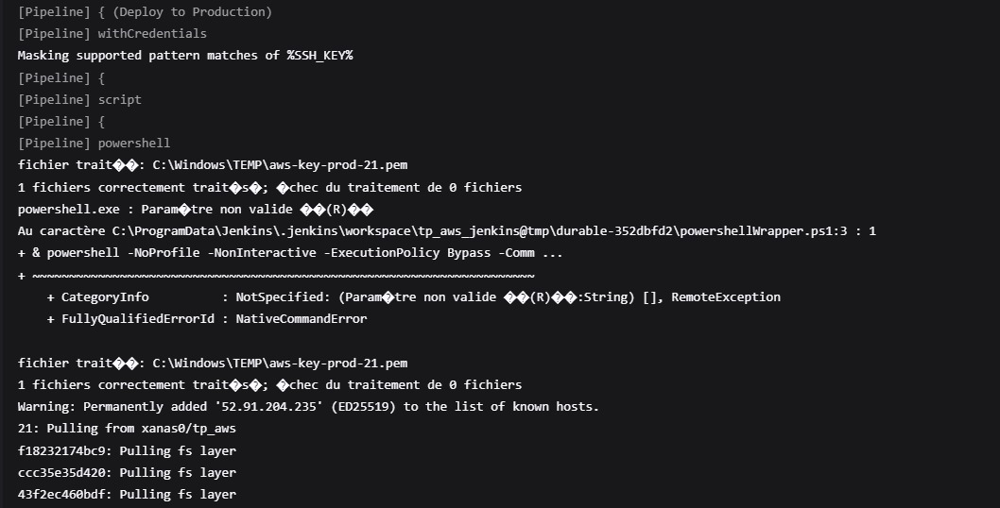

# Rapport de Mini-Projet Aws Jenkins

## Réalisé par :
- Anas Slimani
- Badr Ezziyati

---

## Sommaire
1. [Introduction](#introduction)
2. [Présentation du DockerFile](#présentation-du-dockerfile)
3. [Préparation de la machine aws Ubuntu](#préparation-de-la-machine-aws-ubuntu)
4. [Sortie du console de pipline](#sortie-du-console-de-pipline)
5. [Résultats](#résultats)

---

## Introduction

Dans le cadre des pratiques modernes de développement logiciel, l'automatisation des processus d'intégration et de déploiement est devenue essentielle pour garantir rapidité, fiabilité et qualité des applications. Ce rapport présente la mise en œuvre d'un pipeline CI/CD (Intégration Continue/Déploiement Continu) pour le déploiement automatisé d'une application web statique, en utilisant Jenkins comme outil d'orchestration et AWS comme plateforme d'hébergement.

L'objectif principal de ce projet est de concevoir un pipeline robuste qui assure la construction, les tests, la publication et le déploiement de l'application dans différents environnements simulés (review, staging, production). Pour y parvenir, nous avons utilisé des technologies telles que Docker pour la conteneurisation, Nginx comme serveur web, et Docker Hub pour le stockage des images. Jenkins, avec son système de pipelines déclaratifs, permet d'automatiser l'ensemble de ces étapes, réduisant ainsi les erreurs humaines et accélérant le cycle de livraison.

Ce document détaille les étapes clés du projet, depuis la configuration du Dockerfile et du Jenkinsfile jusqu'aux déploiements successifs sur AWS. Les captures d'écran et les références Git incluses illustrent la mise en pratique des concepts théoriques, offrant une vision complète et concrète de l'implémentation d'une chaîne CI/CD efficace.

À travers ce rapport, nous mettons en lumière les bonnes pratiques et les défis rencontrés, tout en démontrant comment l'automatisation peut transformer le processus de déploiement d'une application web.

---

## Présentation du DockerFile

Voici le Dockerfile utilisé pour créer l'image du static app  :

### 1. code de Dockerfile:

```dockerfile
FROM node:18-alpine as builder
WORKDIR /home/app
COPY app/package*.json ./
RUN npm install
COPY app/ ./

FROM nginx:alpine
COPY --from=builder /home/app/views /usr/share/nginx/html
EXPOSE 80
CMD ["nginx", "-g", "daemon off;"] 
```

* Ce Dockerfile utilise une architecture multi-étapes pour optimiser la construction et le déploiement d'une application web statique. Dans la première étape, basée sur Node.js 18 Alpine, les dépendances de l'application sont installées et le code source est copié. La seconde étape utilise une image légère Nginx Alpine pour servir uniquement les fichiers statiques (contenus dans le dossier `views`), éliminant ainsi les outils de build inutiles en production. Cette approche réduit considérablement la taille de l'image finale, améliore la sécurité en limitant les composants installés, et garantit des performances optimales grâce à Nginx pour la diffusion des contenus statiques. Le port 80 est exposé pour permettre l'accès à l'application, tandis que la commande CMD maintient Nginx en fonctionnement continu.


## Préparation de la machine aws Ubuntu


---


## explication de Jenkinsfile

* Ce Jenkinsfile définit un pipeline CI/CD complet pour déployer une application conteneurisée (Docker) sur trois environnements AWS distincts (Review, Staging, Production) en utilisant Jenkins. Voici une analyse détaillée de chaque étape :

### 1. Configuration Globale

```groovy
environment {
    DOCKER_IMAGE = 'xanas0/tp_aws'
    VERSION = "${env.BUILD_NUMBER ?: 'latest'}"
    REVIEW_ADRESS_IP = "98.81.203.203"
    STAGING_ADRESS_IP = "3.83.251.245"
    PRODUCTION_ADRESS_IP = "52.91.204.235"
}
```
#### Variables d'environnement :


* DOCKER_IMAGE : Nom de l'image Docker sur Docker Hub.

* VERSION : Numéro de build Jenkins ou latest par défaut.

* Adresses IP des instances AWS pour chaque environnement.

### 2. Étapes du Pipeline : 

#### Stage 1 : Checkout Code

```groovy
git branch: 'main', 
    credentialsId: 'github-credentials', 
    url: 'https://github.com/Badr-ezz/tp_jenkins_docker_aws.git'
```

 * Action : Récupère le code source depuis un dépôt Git (branche main).

* Authentification : Utilise des identifiants Jenkins stockés (github-credentials).


#### Stage 2 : Build Docker Image

```groovy 
 docker build -t ${DOCKER_IMAGE}:${VERSION} . 
```

* Action : Construit l'image Docker à partir du Dockerfile présent dans le dépôt.

* Tag : L'image est taguée avec le numéro de build Jenkins.


#### Stage 3 : Test Image


```powershell
  docker run -d -p 8081:80 --name test-container "${DOCKER_IMAGE}:${VERSION}"
Invoke-WebRequest -Uri "http://localhost:8081" -UseBasicParsing
```


* Action :

1 - Lance un conteneur temporaire sur le port 8081.

2 - Vérifie que l'application répond avec un statut HTTP 200.

* Gestion des erreurs :

En cas d'échec, les logs du conteneur sont affichés avant suppression.

#### Stage 4 : Login to Docker Hub

```groovy
withCredentials([usernamePassword(...)]) {
    docker login -u "${DOCKER_USER}" -p "${DOCKER_PASS}"
}
```  
* Action : Authentification sur Docker Hub avec des identifiants sécurisés stockés dans Jenkins (docker-hub-creds).

* Sécurité : Les mots de passe ne sont pas exposés en clair.

#### Stage 5 : Push Docker Image

```groovy
docker push "${DOCKER_IMAGE}:${VERSION}"
```
* Action : Publie l'image Docker sur Docker Hub pour la rendre disponible pour les déploiements.

#### Stages 6-8 : Déploiements (Review/Staging/Production)

* Mécanisme commun :

1 - Préparation de la clé SSH :

 * La clé AWS est temporairement stockée et sécurisée avec icacls.

2 - Commandes SSH :

```powershell
docker pull ${env:DOCKER_IMAGE}:${env:VERSION}
docker stop <env>-app || true
docker run -d -p 80:80 --name <env>-app ${env:DOCKER_IMAGE}:${env:VERSION}
```

* Télécharge la dernière image Docker.

*  Remplace le conteneur existant (si applicable).

* Lance un nouveau conteneur exposé sur le port 80.

3- Gestion des erreurs :

* 3 tentatives maximum en cas d'échec de connexion SSH.

#### Environnements cibles :

* Review : Instance AWS à l'IP 98.81.203.203.

* Staging : Instance AWS à l'IP 3.83.251.245.

* Production : Instance AWS à l'IP 52.91.204.235.

## Sortie du console de pipline





## Résultats


